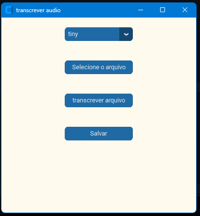

# 🎙️ Transcritor de Áudio com Whisper + Interface Gráfica em Python

Este é um projeto que utiliza o modelo Whisper da OpenAI para transcrever arquivos de áudio, com uma interface moderna e simples desenvolvida com `customtkinter`.

> 🚀 Um projeto criado com foco em aprendizado, organização de código e boas práticas para portfólio.

---

## 📸 Interface



---

## 🧠 Tecnologias utilizadas

- Python 3.10+
- [Whisper](https://github.com/openai/whisper) (modelo de transcrição por IA)
- CustomTkinter (interface gráfica moderna)
- tkinter.messagebox (avisos pop-up)
- tkinter.filedialog (seletor de arquivos)

---

## ⚙️ Como usar

1. Clone este repositório:
   ```bash
   git clone https://github.com/seuusuario/transcritor-whisper-gui.git
   cd transcritor-whisper-gui
   ```

2. Instale os requisitos:
   ```bash
   pip install -r requirements.txt
   ```

   **Ou instale manualmente**:
   ```bash
   pip install openai-whisper
   pip install customtkinter
   ```

3. Execute o programa:
   ```bash
   python transcritor.py
   ```

---

## 🎛️ Funcionalidades

- Selecionar arquivos de áudio (`.mp3`, `.mp4`, etc.)
- Escolher o modelo de transcrição: `tiny`, `base`, `small`, `medium`, `large`
- Transcrição automática do áudio
- Salvamento da transcrição em `.txt`
- Feedback visual com mensagens de erro/sucesso

---

## 📌 O que eu aprendi

- Como usar o modelo Whisper para transcrição de áudio.
- Construção de interface moderna com `customtkinter`.
- Organização de código em funções reutilizáveis.
- Boas práticas de UX com mensagens e validações.
- Uso de bibliotecas padrão para diálogo e manipulação de arquivos.

---

## 🔮 Próximos passos

- Adicionar barra de progresso durante a transcrição.
- Permitir múltiplos arquivos.
- Exportar em outros formatos como `.pdf` ou `.docx`.
- Suporte a legendas `.srt`.

---

## 👨‍💻 Autor

Feito com dedicação por [Kayky Ferreira](https://www.linkedin.com/in/seu-linkedin/).

Se você curtiu o projeto ou tem alguma sugestão, **vamos conversar!**

---

## 📄 Licença

Este projeto está sob a licença MIT. Sinta-se à vontade para usar e modificar.